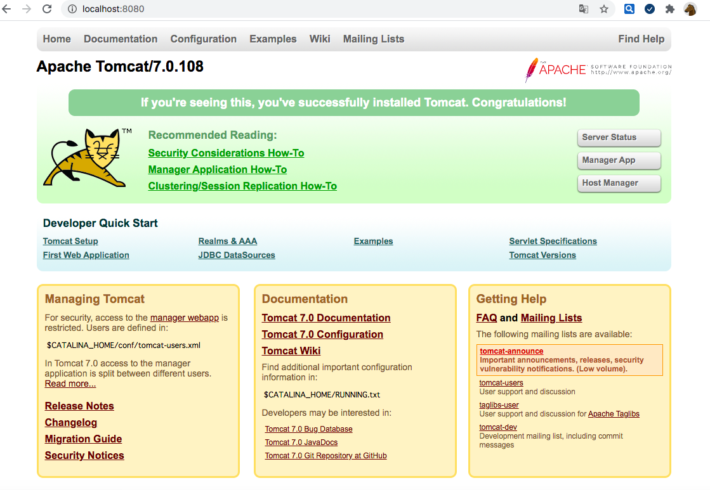
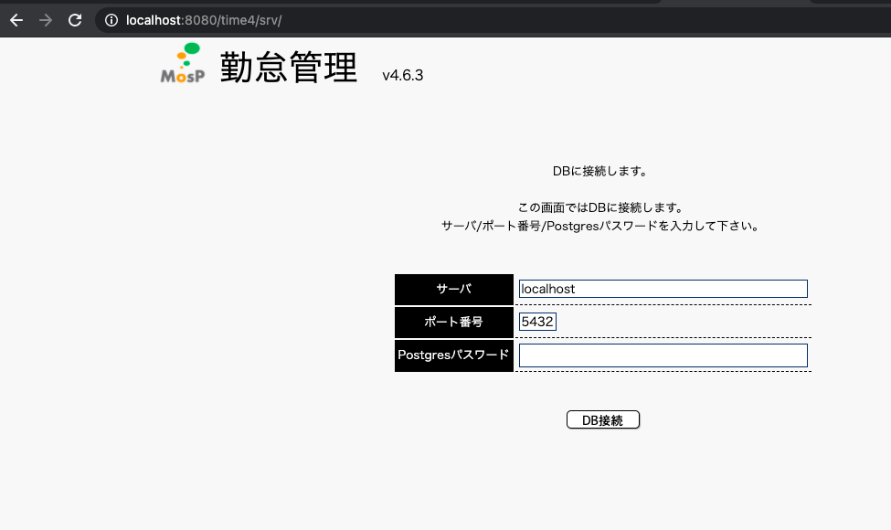

# mosp

## MosP公式サイト

https://mosp.jp/

## OpenSource

https://ja.osdn.net/projects/mosp/

## Version

`4.6.3`

# Git管理

①プロジェクトフォルダを作成する

②ダウンロードした資材をプロジェクトフォルダに置く

③リモートリポジトリにPushする

`$ git add -A`

`$ git branch -M main`

`$ git remote add origin https://github.com/hikarizhen/mosp.git`

`$ git push -u origin main`

# 環境構築

## psotgresql install

```
$ brew search postgresql
==> Formulae
postgresql       postgresql@10    postgresql@11    postgresql@12    postgresql@9.4   postgresql@9.5   postgresql@9.6
==> Casks
homebrew/cask/navicat-for-postgresql
```

ガイドライン　

DB PostgreSQL 9.2.X

`$ brew install postgresql`

`$ postgres --version`

postgres (PostgreSQL) 13.2

## サーバーの起動

`$ postgres -D /usr/local/var/postgres`

```
2021-04-02 09:35:48.614 JST [78741] LOG:  starting PostgreSQL 13.2 on x86_64-apple-darwin17.7.0, compiled by Apple LLVM version 10.0.0 (clang-1000.11.45.5), 64-bit
2021-04-02 09:35:48.620 JST [78741] LOG:  listening on IPv6 address "::1", port 5432
2021-04-02 09:35:48.620 JST [78741] LOG:  listening on IPv4 address "127.0.0.1", port 5432
2021-04-02 09:35:48.624 JST [78741] LOG:  listening on Unix socket "/tmp/.s.PGSQL.5432"
2021-04-02 09:35:48.635 JST [78742] LOG:  database system was shut down at 2021-04-01 16:07:07 JST
2021-04-02 09:35:48.647 JST [78741] LOG:  database system is ready to accept connections
```

## データベース一覧を見る

$ psql -l

## ユーザ作成

```
$ createuser -P mosp
Enter password for new role: mosp
Enter it again: mosp
```

## データベース作成

```
createdb example-db -O mosp
```

`$ createdb example-db -O mosp`

`$ psql -l`

```
                                  List of databases
    Name    |    Owner    | Encoding | Collate | Ctype |      Access privileges      
------------+-------------+----------+---------+-------+-----------------------------
 example-db | mosp        | UTF8     | C       | C     | 
 postgres   | jinghuizhen | UTF8     | C       | C     | 
 template0  | jinghuizhen | UTF8     | C       | C     | =c/jinghuizhen             +
            |             |          |         |       | jinghuizhen=CTc/jinghuizhen
 template1  | jinghuizhen | UTF8     | C       | C     | =c/jinghuizhen             +
            |             |          |         |       | jinghuizhen=CTc/jinghuizhen
(4 rows)

```


## psqlコマンドでDBに接続

`psql -U mosp example-db`


```
$ psql -U mosp example-db
psql (13.2)
Type "help" for help.

example-db=> 
```

# tomcat7
## install

取得

https://tomcat.apache.org/download-70.cgi


ローカルにダウンロードする。

インストール先フォルダで解凍する

`$ unzip apache-tomcat-7.0.108.zip`

`cd apache-tomcat-7.0.108/bin`

`$ chmod +x *.sh`

## tomcatを起動する


```
$ ./startup.sh
Using CATALINA_BASE:   /project/apache-tomcat-7.0.108
Using CATALINA_HOME:   /project/apache-tomcat-7.0.108
Using CATALINA_TMPDIR: /project/apache-tomcat-7.0.108/temp
Using JRE_HOME:        /Library/Java/JavaVirtualMachines/jdk1.8.0_202.jdk/Contents/Home
Using CLASSPATH:       /project/apache-tomcat-7.0.108/bin/bootstrap.jar:/project/apache-tomcat-7.0.108/bin/tomcat-juli.jar
Using CATALINA_OPTS:   
Tomcat started.
```

確認する

`http://localhost:8080/`



# Apache

```
$ httpd -v
Server version: Apache/2.4.33 (Unix)
Server built:   Jan 18 2020 09:52:26
```

## Apacheを起動

`sudo apachectl start`

## Apacheを停止

`sudo apachectl stop`

## Apacheを再起動

`sudo apachectl restart`

## 確認

`$ ps aux | grep httpd`

`http://localhost`

## Apacheの設定ファイル修正
vim /etc/apache2/httpd.conf

## Configファイル

`/etc/apache2/httpd.conf`

vi /etc/httpd/conf.d/proxy_ajp.conf

## Log

$ pwd
/private/var/log/apache2

# Deploy

# Setup

localhost:8080/time4/pub/common/html/setup.html




`psql -U postgres mospv4`

```
$ psql -U postgres mospv4
psql: error: FATAL:  role "postgres" does not exist
```

postgresユーザ作成

```
$ createuser -P postgres
Enter password for new role: postgres
Enter it again: postgres
```
DBに接続してみる

$ psql -U postgres

dropuser postgres
dropdatabase mospv4

`$ dropuser usermosp`

``
dropuser: error: removal of role "usermosp" failed: ERROR:  role "usermosp" cannot be dropped because some objects depend on it
DETAIL:  owner of database mospv4
``

対応

```
$ ps aux | grep mospv4
jinghuizhen      17402   0.0  0.0  4490388   2008   ??  Ss   10:47AM   0:00.10 postgres: usermosp mospv4 127.0.0.1(49565) idle  
jinghuizhen      17400   0.0  0.0  4485312   1816   ??  Ss   10:47AM   0:00.01 postgres: usermosp mospv4 127.0.0.1(49560) idle  
jinghuizhen      17399   0.0  0.0  4485312   1832   ??  Ss   10:47AM   0:00.01 postgres: usermosp mospv4 127.0.0.1(49559) idle  
jinghuizhen      17364   0.0  0.0  4485824   1472   ??  Ss   10:47AM   0:00.02 postgres: usermosp mospv4 127.0.0.1(49556) idle  
jinghuizhen      19621   0.0  0.0  4286840    716 s007  S+    3:10PM   0:00.01 grep mospv4
jingnoMacBook-ea:mumo jinghuizhen$ 
jingnoMacBook-ea:mumo jinghuizhen$ sudo kill 17402
Password:
jingnoMacBook-ea:mumo jinghuizhen$ sudo kill 17400
jingnoMacBook-ea:mumo jinghuizhen$ sudo kill 17399
jingnoMacBook-ea:mumo jinghuizhen$ sudo kill 17364
jingnoMacBook-ea:mumo jinghuizhen$ sudo kill 19621
```

再度データベースを削除する。

`$ dropdb mospv4`

ユーザを削除する

`$ dropuser usermosp`


# やり直し

```
$ psql -l
                                  List of databases
    Name    |    Owner    | Encoding | Collate | Ctype |      Access privileges      
------------+-------------+----------+---------+-------+-----------------------------
 example-db | mosp        | UTF8     | C       | C     | 
 postgres   | jinghuizhen | UTF8     | C       | C     | 
```

# 権限を付与

```
$ psql -d postgres -U jinghuizhen
psql (13.2)
Type "help" for help.

postgres=# 
postgres=# ALTER ROLE postgres superuser;
ALTER ROLE
postgres=# ALTER ROLE jinghuizhen superuser;
ALTER ROLE
postgres=# select rolname, rolsuper, rolcanlogin from pg_roles;
          rolname          | rolsuper | rolcanlogin 
---------------------------+----------+-------------
 pg_monitor                | f        | f
 pg_read_all_settings      | f        | f
 pg_read_all_stats         | f        | f
 pg_stat_scan_tables       | f        | f
 pg_read_server_files      | f        | f
 pg_write_server_files     | f        | f
 pg_execute_server_program | f        | f
 pg_signal_backend         | f        | f
 mosp                      | f        | t
 postgres                  | t        | t
 jinghuizhen               | t        | t
 usermosp                  | f        | t
(12 rows)

postgres=# 
```